# Market ERD

Mermaid `erDiagram`은 속성·관계 라벨의 **따옴표·괄호·슬래시** 등에서 파싱 오류가 납니다. 필드 설명은 아래 표를 참고하세요.

> **범례**
> - 구현 완료 테이블: `USERS`, `AREA`, `STORE`, `ESTIMATED_SALES`, `FLOATING_POPULATION`, `RESIDENT_POPULATION`, `WORKING_POPULATION`, `CONSUMPTION`, `COMMERCIAL_CHANGE`, `APARTMENT`
> - **[예정]** 테이블: `CHAT_SESSIONS`, `CHAT_MESSAGES`, `BOOKMARKS`, `LISTINGS`
> - **[2NF 분리]** 테이블: `SERVICE`, `CHANGE_INDICATOR`
> - **[has-a 분리]** 테이블: 연령대·시간대·소비 카테고리 자식 테이블

> **주의**: 상권 통계 테이블의 `trdar_code + region` 조합이 논리적 FK 역할을 하지만, SQLAlchemy 모델에 명시적 FK 제약은 없습니다.

---

## 정규화 이력

| 단계 | 작업 | 이유 |
|------|------|------|
| 2NF | `MarketStatMixin`에서 `trdar_div_code`, `trdar_div_name`, `trdar_name` 제거 | `trdar_code`에만 종속 → `AREA` 조인으로 대체 |
| 2NF | `SERVICE(service_code, service_name)` 테이블 분리 | `service_name`이 `service_code`에만 부분 종속 |
| 2NF | `CHANGE_INDICATOR(change_indicator, change_indicator_name)` 테이블 분리 | `change_indicator_name`이 `change_indicator`에만 종속 |
| has-a | 연령대 컬럼 그룹 → 자식 테이블 분리 | 70대·80대 등 연령대 추가 가능성 |
| has-a | 시간대 컬럼 그룹 → 자식 테이블 분리 | 시간 구간 세분화 가능성 |
| has-a | 소비 카테고리 컬럼 그룹 → 자식 테이블 분리 | 새 소비 카테고리 추가 가능성 |

---

## 분리 기준

| 항목 | 분리 | 이유 |
|------|------|------|
| 업종 (SERVICE) | ✅ | 새 업종 코드 추가 가능 |
| 상권 변화 지표 (CHANGE_INDICATOR) | ✅ | 새 지표 추가 가능 |
| 연령대 | ✅ | 70대·80대 추가 가능 |
| 시간대 | ✅ | 구간 세분화 가능 |
| 소비 카테고리 | ✅ | 새 카테고리 추가 가능 |
| 성별 | ❌ | male/female 절대 고정 |
| 요일 | ❌ | 7일 절대 고정 |

---

## 공통 컬럼 — MarketStatMixin

`STORE`, `ESTIMATED_SALES`, `FLOATING_POPULATION`, `RESIDENT_POPULATION`, `WORKING_POPULATION`, `CONSUMPTION`, `COMMERCIAL_CHANGE`, `APARTMENT` 8개 테이블이 공통으로 가집니다.

| 컬럼 | 타입 | 설명 |
|------|------|------|
| `id` | int PK | 자동 증가 기본키 |
| `region` | varchar | 데이터 출처 지역 (예: `seoul`) |
| `year_quarter` | int | 기준 년분기 코드 (예: `20251`) |
| `trdar_code` | int | 상권 고유 코드 (논리적 FK → AREA) |

---

## ERD 다이어그램

```mermaid
erDiagram
    USERS ||--o{ CHAT_SESSIONS : owns
    USERS ||--o{ BOOKMARKS : saves
    USERS ||--o{ LISTINGS : registers
    CHAT_SESSIONS ||--o{ CHAT_MESSAGES : contains
    AREA ||--o{ BOOKMARKS : referenced_by
    AREA ||--o{ LISTINGS : listed_in

    AREA ||--o{ STORE : references
    AREA ||--o{ ESTIMATED_SALES : references
    AREA ||--o{ FLOATING_POPULATION : references
    AREA ||--o{ RESIDENT_POPULATION : references
    AREA ||--o{ WORKING_POPULATION : references
    AREA ||--o{ CONSUMPTION : references
    AREA ||--o{ COMMERCIAL_CHANGE : references
    AREA ||--o{ APARTMENT : references

    SERVICE ||--o{ STORE : categorizes
    SERVICE ||--o{ ESTIMATED_SALES : categorizes
    CHANGE_INDICATOR ||--o{ COMMERCIAL_CHANGE : classifies

    ESTIMATED_SALES ||--o{ ESTIMATED_SALES_AGE : has
    ESTIMATED_SALES ||--o{ ESTIMATED_SALES_TIME : has

    FLOATING_POPULATION ||--o{ FLOATING_POPULATION_AGE : has
    FLOATING_POPULATION ||--o{ FLOATING_POPULATION_TIME : has

    WORKING_POPULATION ||--o{ WORKING_POPULATION_AGE : has
    RESIDENT_POPULATION ||--o{ RESIDENT_POPULATION_AGE : has

    CONSUMPTION ||--o{ CONSUMPTION_CATEGORY : has

    USERS {
        int id PK
        varchar email
        varchar password_hash
        varchar name
        varchar role
        varchar status
    }

    AREA {
        int id PK
        varchar region
        varchar trdar_div_code
        varchar trdar_div_name
        int trdar_code
        varchar trdar_name
        int x_coord
        int y_coord
        int district_code
        varchar district_name
        int adm_dong_code
        varchar adm_dong_name
        int area_size
    }

    SERVICE {
        varchar service_code PK
        varchar service_name
    }

    CHANGE_INDICATOR {
        varchar change_indicator PK
        varchar change_indicator_name
    }

    STORE {
        int id PK
        int trdar_code
        int year_quarter
        varchar region
        varchar service_code FK
        int store_count
        int similar_industry_store_count
        int opening_rate
        int opening_store_count
        int closure_rate
        int closure_store_count
        int franchise_store_count
    }

    ESTIMATED_SALES {
        int id PK
        int trdar_code
        int year_quarter
        varchar region
        varchar service_code FK
        bigint monthly_sales_amount
        int monthly_sales_count
        bigint weekday_sales_amount
        bigint weekend_sales_amount
        bigint male_sales_amount
        int male_sales_count
        bigint female_sales_amount
        int female_sales_count
        bigint mon_sales_amount
        int mon_sales_count
        bigint tue_sales_amount
        int tue_sales_count
        bigint wed_sales_amount
        int wed_sales_count
        bigint thu_sales_amount
        int thu_sales_count
        bigint fri_sales_amount
        int fri_sales_count
        bigint sat_sales_amount
        int sat_sales_count
        bigint sun_sales_amount
        int sun_sales_count
    }

    ESTIMATED_SALES_AGE {
        int id PK
        int sales_id FK
        varchar age_group
        bigint sales_amount
        int sales_count
    }

    ESTIMATED_SALES_TIME {
        int id PK
        int sales_id FK
        varchar time_slot
        bigint sales_amount
        int sales_count
    }

    FLOATING_POPULATION {
        int id PK
        int trdar_code
        int year_quarter
        varchar region
        int total_floating_pop
        int male_floating_pop
        int female_floating_pop
        int mon_floating_pop
        int tue_floating_pop
        int wed_floating_pop
        int thu_floating_pop
        int fri_floating_pop
        int sat_floating_pop
        int sun_floating_pop
    }

    FLOATING_POPULATION_AGE {
        int id PK
        int fp_id FK
        varchar age_group
        int count
    }

    FLOATING_POPULATION_TIME {
        int id PK
        int fp_id FK
        varchar time_slot
        int count
    }

    WORKING_POPULATION {
        int id PK
        int trdar_code
        int year_quarter
        varchar region
        int total_working_pop
        int male_working_pop
        int female_working_pop
    }

    WORKING_POPULATION_AGE {
        int id PK
        int wp_id FK
        varchar age_group
        int total_count
        int male_count
        int female_count
    }

    RESIDENT_POPULATION {
        int id PK
        int trdar_code
        int year_quarter
        varchar region
        int total_resident_pop
        int male_resident_pop
        int female_resident_pop
        int total_household_count
        int apartment_household_count
        int non_apartment_household_count
    }

    RESIDENT_POPULATION_AGE {
        int id PK
        int rp_id FK
        varchar age_group
        int total_count
        int male_count
        int female_count
    }

    CONSUMPTION {
        int id PK
        int trdar_code
        int year_quarter
        varchar region
        float monthly_avg_income
        int income_range_code
        float total_expenditure
    }

    CONSUMPTION_CATEGORY {
        int id PK
        int consumption_id FK
        varchar category
        float expenditure
    }

    COMMERCIAL_CHANGE {
        int id PK
        int trdar_code
        int year_quarter
        varchar region
        varchar change_indicator FK
        int operating_months_avg
        int closure_months_avg
        int seoul_operating_months_avg
        int seoul_closure_months_avg
    }

    APARTMENT {
        int id PK
        int trdar_code
        int year_quarter
        varchar region
        int complex_count
        int area_under_66_count
        int area_66_99_count
        int area_99_132_count
        int area_132_165_count
        int area_over_165_count
        int price_under_1b_count
        int price_1b_2b_count
        int price_2b_3b_count
        int price_3b_4b_count
        int price_4b_5b_count
        int price_5b_6b_count
        int price_over_6b_count
        int avg_area
        bigint avg_price
    }

    CHAT_SESSIONS {
        int id PK
        int user_id FK
        varchar title
        varchar status
        timestamp created_at
    }

    CHAT_MESSAGES {
        int id PK
        int session_id FK
        varchar role
        text content
        timestamp created_at
    }

    BOOKMARKS {
        int id PK
        int user_id FK
        int trdar_code
        varchar region
        timestamp created_at
    }

    LISTINGS {
        int id PK
        int user_id FK
        int trdar_code
        varchar region
        varchar title
        text description
        bigint price
        varchar status
        timestamp created_at
    }
```

---

## 관계

### USERS 중심 관계 (예정 포함)

| 관계 | 상태 | 설명 |
|------|------|------|
| USERS → CHAT_SESSIONS | **[예정]** | 1:N, 사용자별 채팅 세션 |
| CHAT_SESSIONS → CHAT_MESSAGES | **[예정]** | 1:N, 세션 내 메시지 이력 |
| USERS → BOOKMARKS | **[예정]** | 1:N, 관심 상권 북마크 |
| USERS → LISTINGS | **[예정]** | 1:N, 상권 매물 등록 |

### 상권 통계 관계

| 관계 | 설명 |
|------|------|
| AREA → STORE | 1:N, `trdar_code + region` 기준 분기별·업종별 점포 현황 |
| AREA → ESTIMATED_SALES | 1:N, `trdar_code + region` 기준 분기별·업종별 추정 매출 |
| AREA → FLOATING_POPULATION | 1:N, `trdar_code + region` 기준 분기별 유동인구 |
| AREA → RESIDENT_POPULATION | 1:N, `trdar_code + region` 기준 분기별 상주인구 |
| AREA → WORKING_POPULATION | 1:N, `trdar_code + region` 기준 분기별 직장인구 |
| AREA → CONSUMPTION | 1:N, `trdar_code + region` 기준 분기별 소비 현황 |
| AREA → COMMERCIAL_CHANGE | 1:N, `trdar_code + region` 기준 분기별 상권 변화 |
| AREA → APARTMENT | 1:N, `trdar_code + region` 기준 분기별 아파트 현황 |

### has-a 자식 테이블 관계 (비식별)

| 부모 | 자식 | FK | 행 수/부모 | 확장 가능 항목 |
|------|------|----|-----------|--------------|
| ESTIMATED_SALES | ESTIMATED_SALES_AGE | sales_id | 6행~ | 70대, 80대 추가 |
| ESTIMATED_SALES | ESTIMATED_SALES_TIME | sales_id | 6행~ | 시간 구간 세분화 |
| FLOATING_POPULATION | FLOATING_POPULATION_AGE | fp_id | 6행~ | 70대, 80대 추가 |
| FLOATING_POPULATION | FLOATING_POPULATION_TIME | fp_id | 6행~ | 시간 구간 세분화 |
| WORKING_POPULATION | WORKING_POPULATION_AGE | wp_id | 6행~ | 70대, 80대 추가 |
| RESIDENT_POPULATION | RESIDENT_POPULATION_AGE | rp_id | 6행~ | 70대, 80대 추가 |
| CONSUMPTION | CONSUMPTION_CATEGORY | consumption_id | 9행~ | 새 소비 항목 추가 |

---

## 유니크 제약 조건

| 테이블 | 유니크 키 | 의미 |
|--------|-----------|------|
| users | `email` | 이메일 중복 방지 |
| area | `(trdar_code, region)` | 지역별 상권 중복 방지 |
| service | `service_code` | 업종 코드 중복 방지 |
| change_indicator | `change_indicator` | 변화 지표 코드 중복 방지 |
| store | `(year_quarter, trdar_code, service_code, region)` | 분기·상권·업종별 1건 |
| estimated_sales | `(year_quarter, trdar_code, service_code, region)` | 분기·상권·업종별 1건 |
| estimated_sales_age | `(sales_id, age_group)` | 부모당 연령대 1건 |
| estimated_sales_time | `(sales_id, time_slot)` | 부모당 시간대 1건 |
| floating_population | `(year_quarter, trdar_code, region)` | 분기·상권별 1건 |
| floating_population_age | `(fp_id, age_group)` | 부모당 연령대 1건 |
| floating_population_time | `(fp_id, time_slot)` | 부모당 시간대 1건 |
| working_population | `(year_quarter, trdar_code, region)` | 분기·상권별 1건 |
| working_population_age | `(wp_id, age_group)` | 부모당 연령대 1건 |
| resident_population | `(year_quarter, trdar_code, region)` | 분기·상권별 1건 |
| resident_population_age | `(rp_id, age_group)` | 부모당 연령대 1건 |
| consumption | `(year_quarter, trdar_code, region)` | 분기·상권별 1건 |
| consumption_category | `(consumption_id, category)` | 부모당 카테고리 1건 |
| commercial_change | `(year_quarter, trdar_code, region)` | 분기·상권별 1건 |
| apartment | `(year_quarter, trdar_code, region)` | 분기·상권별 1건 |
| bookmarks | `(user_id, trdar_code, region)` | **[예정]** 사용자당 상권 중복 북마크 방지 |

---

## 전체 컬럼 상세

### AREA

| 컬럼 | 한국어 원본 | 설명 |
|------|-------------|------|
| id | - | PK |
| region | - | 데이터 출처 지역 구분 (예: `seoul`) |
| trdar_div_code | 상권_구분_코드 | A: 골목, B: 발달, C: 전통시장, D: 관광특구 |
| trdar_div_name | 상권_구분_코드_명 | 상권 구분명 |
| trdar_code | 상권_코드 | 상권 고유 코드 |
| trdar_name | 상권_코드_명 | 상권명 |
| x_coord | 엑스좌표_값 | TM 좌표 (property로 WGS84 변환) |
| y_coord | 와이좌표_값 | TM 좌표 |
| district_code | 자치구_코드 | |
| district_name | 자치구_코드_명 | |
| adm_dong_code | 행정동_코드 | |
| adm_dong_name | 행정동_코드_명 | |
| area_size | 영역_면적 | 상권 면적 |

### SERVICE (2NF 분리)

| 컬럼 | 타입 | 설명 |
|------|------|------|
| service_code | varchar PK | 서비스 업종 코드 |
| service_name | varchar | 서비스 업종명 |

### CHANGE_INDICATOR (2NF 분리)

| 컬럼 | 타입 | 설명 |
|------|------|------|
| change_indicator | varchar PK | 상권 변화 지표 코드 |
| change_indicator_name | varchar | 상권 변화 지표명 (예: 다이나믹, 정체) |

### STORE

| 컬럼 | 타입 | 설명 |
|------|------|------|
| service_code | varchar FK → SERVICE | 업종 코드 |
| store_count | int | 점포 수 |
| similar_industry_store_count | int | 유사 업종 점포 수 |
| opening_rate | int | 개업률 (%) |
| opening_store_count | int | 개업 점포 수 |
| closure_rate | int | 폐업률 (%) |
| closure_store_count | int | 폐업 점포 수 |
| franchise_store_count | int | 프랜차이즈 점포 수 |

### ESTIMATED_SALES (고유 컬럼)

| 컬럼 그룹 | 컬럼명 | 타입 |
|-----------|--------|------|
| 업종 | service_code FK → SERVICE | varchar |
| 월간 합계 | monthly_sales_amount, monthly_sales_count | bigint, int |
| 주중·주말 | weekday_sales_amount, weekend_sales_amount | bigint |
| 성별 금액 | male_sales_amount, female_sales_amount | bigint |
| 성별 건수 | male_sales_count, female_sales_count | int |
| 요일별 금액 (7개) | mon ~ sun _sales_amount | bigint |
| 요일별 건수 (7개) | mon ~ sun _sales_count | int |

### ESTIMATED_SALES_AGE (has-a, 비식별)

| 컬럼 | 타입 | 설명 |
|------|------|------|
| sales_id | int FK | 부모 참조 |
| age_group | varchar | `10` / `20` / `30` / `40` / `50` / `60_plus` / ... |
| sales_amount | bigint | 연령대별 매출 금액 |
| sales_count | int | 연령대별 매출 건수 |

### ESTIMATED_SALES_TIME (has-a, 비식별)

| 컬럼 | 타입 | 설명 |
|------|------|------|
| sales_id | int FK | 부모 참조 |
| time_slot | varchar | `00_06` / `06_11` / `11_14` / `14_17` / `17_21` / `21_24` / ... |
| sales_amount | bigint | 시간대별 매출 금액 |
| sales_count | int | 시간대별 매출 건수 |

### FLOATING_POPULATION (고유 컬럼)

| 컬럼 그룹 | 컬럼명 | 타입 |
|-----------|--------|------|
| 합계 | total_floating_pop | int |
| 성별 | male_floating_pop, female_floating_pop | int |
| 요일별 (7개) | mon ~ sun _floating_pop | int |

### FLOATING_POPULATION_AGE (has-a, 비식별)

| 컬럼 | 타입 | 설명 |
|------|------|------|
| fp_id | int FK | 부모 참조 |
| age_group | varchar | `10` / `20` / ... / `60_plus` / ... |
| count | int | 연령대별 유동인구 수 |

### FLOATING_POPULATION_TIME (has-a, 비식별)

| 컬럼 | 타입 | 설명 |
|------|------|------|
| fp_id | int FK | 부모 참조 |
| time_slot | varchar | `00_06` / `06_11` / ... |
| count | int | 시간대별 유동인구 수 |

### WORKING_POPULATION (고유 컬럼)

| 컬럼 | 타입 | 설명 |
|------|------|------|
| total_working_pop | int | 전체 직장인구 |
| male_working_pop | int | 남성 직장인구 |
| female_working_pop | int | 여성 직장인구 |

### WORKING_POPULATION_AGE (has-a, 비식별)

| 컬럼 | 타입 | 설명 |
|------|------|------|
| wp_id | int FK | 부모 참조 |
| age_group | varchar | `10` / `20` / ... / `60_plus` / ... |
| total_count | int | 연령대별 전체 직장인구 |
| male_count | int | 연령대별 남성 직장인구 |
| female_count | int | 연령대별 여성 직장인구 |

### RESIDENT_POPULATION (고유 컬럼)

| 컬럼 | 타입 | 설명 |
|------|------|------|
| total_resident_pop | int | 전체 상주인구 |
| male_resident_pop | int | 남성 상주인구 |
| female_resident_pop | int | 여성 상주인구 |
| total_household_count | int | 전체 가구 수 |
| apartment_household_count | int | 아파트 가구 수 |
| non_apartment_household_count | int | 비아파트 가구 수 |

### RESIDENT_POPULATION_AGE (has-a, 비식별)

| 컬럼 | 타입 | 설명 |
|------|------|------|
| rp_id | int FK | 부모 참조 |
| age_group | varchar | `10` / `20` / ... / `60_plus` / ... |
| total_count | int | 연령대별 전체 상주인구 |
| male_count | int | 연령대별 남성 상주인구 |
| female_count | int | 연령대별 여성 상주인구 |

### CONSUMPTION (고유 컬럼)

| 컬럼 | 타입 | nullable | 설명 |
|------|------|----------|------|
| monthly_avg_income | float | ✓ | 월 평균 소득 금액 |
| income_range_code | int | ✓ | 소득 구간 코드 |
| total_expenditure | float | ✓ | 지출 총금액 |

### CONSUMPTION_CATEGORY (has-a, 비식별)

| 컬럼 | 타입 | nullable | 설명 |
|------|------|----------|------|
| consumption_id | int FK | | 부모 참조 |
| category | varchar | | `food` / `clothing` / `household` / `medical` / `transport` / `leisure` / `culture` / `education` / `entertainment` / ... |
| expenditure | float | ✓ | 카테고리별 지출 금액 |

### COMMERCIAL_CHANGE

| 컬럼 | 타입 | 설명 |
|------|------|------|
| change_indicator | varchar FK → CHANGE_INDICATOR | 상권 변화 지표 코드 |
| operating_months_avg | int | 운영 영업 개월 평균 |
| closure_months_avg | int | 폐업 영업 개월 평균 |
| seoul_operating_months_avg | int | 서울 평균 운영 개월 |
| seoul_closure_months_avg | int | 서울 평균 폐업 개월 |

### APARTMENT

| 컬럼 그룹 | 컬럼명 | 타입 | nullable |
|-----------|--------|------|----------|
| 단지 | complex_count | int | |
| 면적별 세대 수 (5개) | area_under_66 / area_66_99 / area_99_132 / area_132_165 / area_over_165 _count | int | ✓ |
| 가격별 세대 수 (7개) | price_under_1b / price_1b_2b / price_2b_3b / price_3b_4b / price_4b_5b / price_5b_6b / price_over_6b _count | int | ✓ |
| 평균 | avg_area, avg_price | int, bigint | |

> `nullable=True` 컬럼은 공공데이터에 값이 없는 경우가 있어 허용.
> `ApartmentRepository`는 대용량 처리를 위해 `_batch_size = 5000` 적용.

### USERS

| 컬럼 | 타입 | 설명 |
|------|------|------|
| id | int PK | |
| email | varchar | 로그인 식별자 (unique) |
| password_hash | varchar | bcrypt 해시 |
| name | varchar | 표시 이름 |
| role | varchar | `free` / `paid` / `listing` / `admin` |
| status | varchar | `active` / `suspended` / `deleted` |

### status 값 정의

| 테이블 | status 값 | 설명 |
|--------|-----------|------|
| USERS | `active` | 정상 이용 중 |
| USERS | `suspended` | 정지 |
| USERS | `deleted` | 탈퇴 (소프트 딜리트) |
| CHAT_SESSIONS | `active` | 진행 중인 세션 |
| CHAT_SESSIONS | `archived` | 보관된 세션 |
| LISTINGS | `active` | 게시 중 |
| LISTINGS | `sold` | 거래 완료 |
| LISTINGS | `hidden` | 작성자가 숨김 처리 |

### 회원 역할 (role)

| role | 설명 | 주요 권한 |
|------|------|-----------|
| `free` | 무료 회원 | 기본 상권 조회, 채팅 (제한) |
| `paid` | 유료 회원 | 채팅 무제한, 북마크, 상세 분석 |
| `listing` | 매물 등록 회원 | paid 권한 + 상권 매물 등록 |
| `admin` | 어드민 | 전체 관리 |
