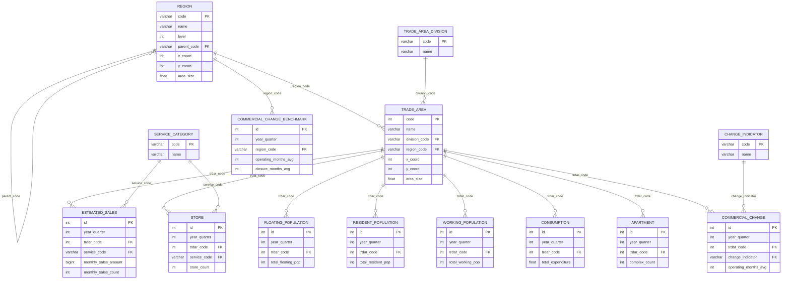

# MARKET_ERD — 서울 상권 3NF 스키마

market CLAUDE → [[minseok/apps/market/_docs/CLAUDE|market CLAUDE]]

서울시 상권분석서비스 CSV를 발자국 ERD 컨벤션으로 정규화한 스키마.
차원 5 + 팩트 8(상권 단위) + 지역 벤치마크 1(시도 단위).
ORM 소스: `adapter/outbound/orm/` (SQLAlchemy 2.0 `Mapped` 스타일).
전국 확장을 전제로 서울 하드코딩 없이 지역(`region`) 계층으로 일반화한다.

---

## 정규화 배경

원본(denormalized) 팩트들은 `상권_코드_명·상권_구분_코드_명·자치구·서비스_업종_코드_명`을
매 테이블에 중복 보유했다(`상권_코드 → 상권명` 이행 종속 = 3NF 위반). 차원을 추출해 이행 종속을
제거했다. 분해 컬럼(연령대·시간대·요일별)은 각각 PK에만 종속인 원자 속성이므로 넓게 유지한다
(행 분리는 과정규화).

### 분리 기준

| 항목 | 차원 분리 | 이유 |
|------|----------|------|
| 업종 (`service_category`) | ✅ | 새 업종 코드 추가 가능, 업종명 이행 종속 제거 |
| 상권 변화 지표 (`change_indicator`) | ✅ | 새 지표 추가 가능, 지표명 이행 종속 제거 |
| 상권 구분 (`trade_area_division`) | ✅ | 구분명 이행 종속 제거 |
| 지역 (`region`) | ✅ | 자치구·행정동명 이행 종속 제거, 자기참조 계층 |
| 서울 평균 (`commercial_change_benchmark`) | ✅ | 분기+지역에만 종속(부분 종속) — 상권 팩트에서 분리 |
| 연령대 컬럼 | ❌ (넓게 유지) | PK에만 종속인 원자 속성 — 행 분리는 과정규화 |
| 시간대 컬럼 | ❌ (넓게 유지) | 상동 (6개 구간 고정) |
| 성별·요일 컬럼 | ❌ (넓게 유지) | male/female · 7일 절대 고정 |

## ERD 다이어그램



> 팩트의 측정 컬럼(연령대·시간대·요일 분해 등)은 다이어그램에서 대표 컬럼만 표기 —
> 전체 목록은 아래 "전체 컬럼 상세" 참고.

## 차원 (5)

| 테이블 | 키 | 비고 |
|--------|-----|------|
| `region` | `code` PK | 시도(level0) → 자치구(level1) → 행정동(level2) **자기참조** `parent_code` |
| `trade_area_division` | `code` PK | A 골목 / D 발달 / R 전통시장 / U 관광특구 |
| `service_category` | `code` PK | 서비스 업종(예: CS100010 → 커피-음료). 평면 |
| `change_indicator` | `code` PK | HH 정체 / LL 다이나믹 / LH 상권확장 / HL 상권축소 |
| `trade_area` | `code`(상권_코드) PK | 중심 차원. `division_code` FK, `region_code`(행정동) FK, x/y 좌표, `lat`/`lng` property |

### region

| 컬럼 | 타입 | nullable | 한국어 원본 | 설명 |
|------|------|----------|-------------|------|
| `code` | varchar(20) PK | | 자치구_코드 / 행정동_코드 | 시도는 행정표준코드(서울=`11`) |
| `name` | varchar(50) | | 자치구_코드_명 / 행정동_코드_명 | |
| `level` | int | | - | 0=시도, 1=자치구, 2=행정동 |
| `parent_code` | varchar FK → region.code | ✓ | - | 행정동→자치구, 자치구→시도 (시도는 NULL) |
| `x_coord`, `y_coord` | int | ✓ | 엑스좌표_값, 와이좌표_값 | TM 좌표 — 자치구/시군구 중심좌표(지도 시각화용) |
| `area_size` | float | ✓ | 영역_면적 | |

### trade_area_division

| 컬럼 | 타입 | 설명 |
|------|------|------|
| `code` | varchar(2) PK | A / D / R / U |
| `name` | varchar(30) | 골목상권 / 발달상권 / 전통시장 / 관광특구 |

### service_category

| 컬럼 | 타입 | 설명 |
|------|------|------|
| `code` | varchar(20) PK | 서비스_업종_코드 (예: CS100010) |
| `name` | varchar(80) | 서비스_업종_코드_명 (예: 커피-음료) |

### change_indicator

| 컬럼 | 타입 | 설명 |
|------|------|------|
| `code` | varchar(4) PK | HH / LL / LH / HL |
| `name` | varchar(30) | 정체 / 다이나믹 / 상권확장 / 상권축소 |

### trade_area (중심 차원)

| 컬럼 | 타입 | nullable | 한국어 원본 | 설명 |
|------|------|----------|-------------|------|
| `code` | int PK | | 상권_코드 | 팩트들이 참조하는 자연키 |
| `name` | varchar(100) | | 상권_코드_명 | |
| `division_code` | varchar FK → trade_area_division.code | | 상권_구분_코드 | |
| `region_code` | varchar FK → region.code | ✓ | 행정동_코드 | 행정동. 자치구는 `parent_code`로 도달 |
| `x_coord`, `y_coord` | int | | 엑스좌표_값, 와이좌표_값 | TM(EPSG:5174) 좌표 |
| `area_size` | float | ✓ | 영역_면적 | |
| `lat`, `lng` | property | | - | `utils/coords.py`의 `tm_to_wgs84`로 WGS84 변환 (컬럼 아님) |

## 팩트 (8)

공통 `MarketStatMixin`: `id`(대리키) + `year_quarter` + `trdar_code`(FK → `trade_area.code`).
측정 컬럼만 보유하고 차원 속성은 갖지 않는다. `year_quarter`·`trdar_code`·팩트별 FK에 index.

| 테이블 | 추가 FK | 유니크 (제약명) |
|--------|--------|----------------|
| `estimated_sales` | `service_code` → service_category | (year_quarter, trdar_code, service_code) `uq_estimated_sales` |
| `store` | `service_code` → service_category | (year_quarter, trdar_code, service_code) `uq_store` |
| `floating_population` | — | (year_quarter, trdar_code) `uq_floating_population` |
| `resident_population` | — | (year_quarter, trdar_code) `uq_resident_population` |
| `working_population` | — | (year_quarter, trdar_code) `uq_working_population` |
| `consumption` | — | (year_quarter, trdar_code) `uq_consumption` |
| `apartment` | — | (year_quarter, trdar_code) `uq_apartment` |
| `commercial_change` | `change_indicator` → change_indicator | (year_quarter, trdar_code) `uq_commercial_change` |

### 공통 컬럼 — MarketStatMixin

| 컬럼 | 타입 | 설명 |
|------|------|------|
| `id` | int PK | 대리키 (자동 증가) |
| `year_quarter` | int | 기준_년분기_코드 (예: `20251`) |
| `trdar_code` | int FK → trade_area.code | 상권_코드 |

## 전체 컬럼 상세 — 팩트

### estimated_sales (추정매출, 분기·상권·업종별)

금액은 bigint, 건수는 int. 동일 분해 축을 `_sales_amount` / `_sales_count` 쌍으로 보유.

| 컬럼 그룹 | 컬럼 | 타입 |
|-----------|------|------|
| 업종 | `service_code` FK → service_category | varchar |
| 월간 합계 | `monthly_sales_amount` / `monthly_sales_count` | bigint / int |
| 주중·주말 | `weekday_`, `weekend_` × amount·count | bigint / int |
| 요일별 (7) | `mon_` ~ `sun_` × amount·count | bigint / int |
| 시간대별 (6) | `time_00_06_`, `time_06_11_`, `time_11_14_`, `time_14_17_`, `time_17_21_`, `time_21_24_` × amount·count | bigint / int |
| 성별 (2) | `male_`, `female_` × amount·count | bigint / int |
| 연령대별 (6) | `age_10_` ~ `age_50_`, `age_60_plus_` × amount·count | bigint / int |

### store (점포, 분기·상권·업종별)

| 컬럼 | 타입 | 설명 |
|------|------|------|
| `service_code` | varchar FK → service_category | 업종 코드 |
| `store_count` | int | 점포 수 |
| `similar_industry_store_count` | int | 유사 업종 점포 수 |
| `opening_rate` / `opening_store_count` | int | 개업률(%) / 개업 점포 수 |
| `closure_rate` / `closure_store_count` | int | 폐업률(%) / 폐업 점포 수 |
| `franchise_store_count` | int | 프랜차이즈 점포 수 |

### floating_population (유동인구, 분기·상권별)

| 컬럼 그룹 | 컬럼 | 타입 |
|-----------|------|------|
| 합계 | `total_floating_pop` | int |
| 성별 (2) | `male_`, `female_floating_pop` | int |
| 연령대별 (6) | `age_10_` ~ `age_50_`, `age_60_plus_floating_pop` | int |
| 시간대별 (6) | `time_00_06_` ~ `time_21_24_floating_pop` | int |
| 요일별 (7) | `mon_` ~ `sun_floating_pop` | int |

### resident_population (상주인구, 분기·상권별)

| 컬럼 그룹 | 컬럼 | 타입 |
|-----------|------|------|
| 합계·성별 | `total_`, `male_`, `female_resident_pop` | int |
| 연령대별 (6) | `age_10_` ~ `age_60_plus_resident_pop` | int |
| 성별×연령대 (12) | `male_age_10_` ~ `male_age_60_plus_`, `female_age_10_` ~ `female_age_60_plus_resident_pop` | int |
| 가구 | `total_household_count`, `apartment_household_count`, `non_apartment_household_count` | int |

### working_population (직장인구, 분기·상권별)

| 컬럼 그룹 | 컬럼 | 타입 |
|-----------|------|------|
| 합계·성별 | `total_`, `male_`, `female_working_pop` | int |
| 연령대별 (6) | `age_10_` ~ `age_60_plus_working_pop` | int |
| 성별×연령대 (12) | `male_age_10_` ~ `female_age_60_plus_working_pop` | int |

### consumption (소비, 분기·상권별) — 전 측정 컬럼 nullable

| 컬럼 | 타입 | 설명 |
|------|------|------|
| `monthly_avg_income` | float ✓ | 월 평균 소득 금액 |
| `income_range_code` | int ✓ | 소득 구간 코드 |
| `total_expenditure` | float ✓ | 지출 총금액 |
| 카테고리별 지출 (9) | `food_`, `clothing_`, `household_`, `medical_`, `transport_`, `leisure_`, `culture_`, `education_`, `entertainment_expenditure` — float ✓ | 식료품·의류·생활용품·의료·교통·여가·문화·교육·유흥 |

### apartment (아파트, 분기·상권별)

| 컬럼 그룹 | 컬럼 | 타입 |
|-----------|------|------|
| 단지 | `complex_count` | int |
| 면적별 세대 수 (5) | `area_under_66_count`, `area_66_count`, `area_99_count`, `area_132_count`, `area_165_count` | int ✓ |
| 가격별 세대 수 (7) | `price_under_1b_count`, `price_1b_count` ~ `price_5b_count`, `price_over_6b_count` | int ✓ |
| 평균 | `avg_area` / `avg_price` | int / bigint |

### commercial_change (상권변화, 분기·상권별)

| 컬럼 | 타입 | 설명 |
|------|------|------|
| `change_indicator` | varchar FK → change_indicator.code | 상권 변화 지표 코드 |
| `operating_months_avg` / `closure_months_avg` | int | 운영/폐업 영업 개월 평균 |

### commercial_change_benchmark (지역 벤치마크, 분기·시도별)

원본 CSV의 `서울_운영/폐업_영업_개월_평균`은 (year_quarter, trdar_code) 중 분기에만
종속(부분 종속)이라 시도 단위 테이블로 분리. 전국 확장 시 시도별 행이 늘어난다.
유니크: (year_quarter, region_code) `uq_commercial_change_benchmark`.

| 컬럼 | 타입 | 설명 |
|------|------|------|
| `id` | int PK | 대리키 |
| `year_quarter` | int | 기준 년분기 |
| `region_code` | varchar FK → region.code | 시도 코드 (서울=`11`) |
| `operating_months_avg` / `closure_months_avg` | int | 지역 평균 운영/폐업 개월 |

> `nullable` ✓ 컬럼은 공공데이터에 값이 없는 경우가 있어 허용 (consumption·apartment).

## 조인 관계

```
fact ──trdar_code──▶ trade_area ──division_code──▶ trade_area_division
                          │
                          └─region_code──▶ region(행정동) ──parent_code──▶ region(자치구)
                                                                              └─parent_code──▶ region(시도)
estimated_sales/store ──service_code──▶ service_category
commercial_change ──change_indicator──▶ change_indicator
commercial_change_benchmark ──region_code──▶ region(시도)
```

## 적재

`scripts/ingest_seoul_3nf.py`가 차원(시도→자치구→행정동 포함) → 팩트(FK 무결성 필터)
→ 시도 벤치마크 순으로 적재.
매핑은 `adapter/outbound/csv/column_maps.py`. 조회 경로 → [[minseok/apps/market/_docs/CLAUDE|market CLAUDE]].
